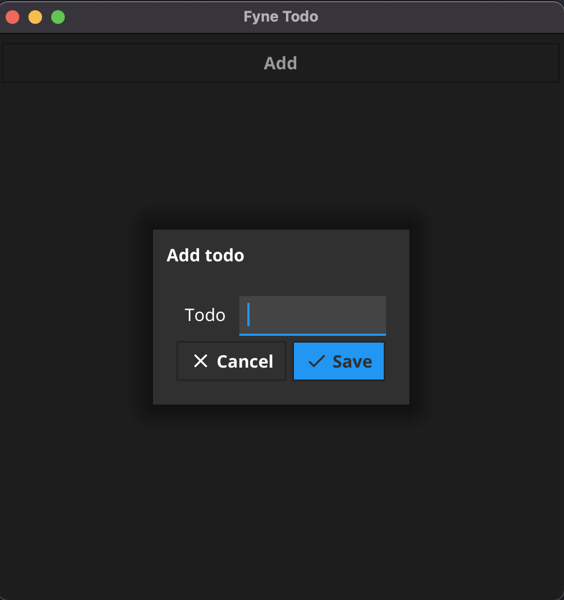

# Simple Fyne Todo

A simple Todo App

All todos are stored in memory and will be lost if when the app is closed.

## Installing

`git clone https://github.com/ivange94/fynetodo.git`

`cd fynetodo`

`go install`

## Running the app

To run the app just invoke the executable `fynetodo`.

## Adding a Todo
To add a tody, just click on the *Add* button and enter the todo.

## Deleting a Todo
Clicking on the radio button on the todo marks it as completed and removes it from the list.

## Images

### Home screen

### Add todo

### Todo list

